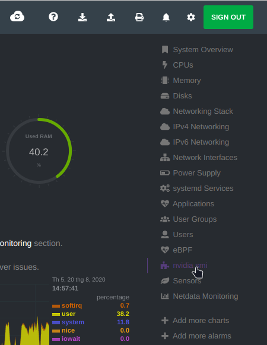
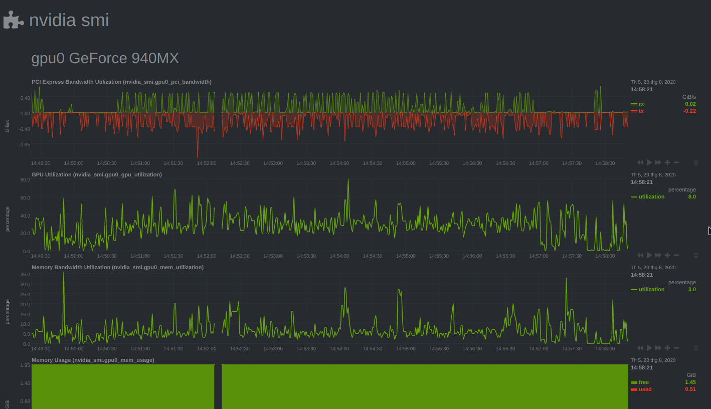

# restart_server
restart server: schedule shutdown, start/stop/restart services, logging, health-check  

---

Table of contents:
  - [Health-check on agents](#health-check-on-agents)
    - [Install Netdata](#install-netdata)
    - [Enable GPU monitoring](#enable-gpu-monitoring)
    - [Multihost monitoring](#multihost-monitoring)
  - [Cronjobs](#cronjobs)
  - [Startup jobs](#startup-jobs)
  - [Sample](#sample)

---
## Health-check on agents
### Install Netdata
Netdata can be easily downloaded and installed via `curl` and installer script:
```bash
$ bash <(curl -Ss https://my-netdata.io/kickstart.sh) --stable-channel --disable-telemetry
```
>More: https://learn.netdata.cloud/docs/agent/packaging/installer
### Enable GPU monitoring
GPU monitoring function requires `nvidia-smi` as dependence. By default, nvidia-smi is already installed with nvidia driver. First, make sure that nvidia-smi is available on your host:
```bash
$ nvidia-smi -h
```
If not, install/re-install the nvidia driver and make sure `nvidia-smi` works well.  
Edit configuration file:
- ``` bash
    $ cd /etc/netdata
    ```
- Edit the configuration file at `/usr/lib/netdata/conf.d/python.d.conf`, e.g 
    ```bash
    $ sudo nano /usr/lib/netdata/conf.d/python.d.conf
    ```
- Remove the hash `#` at the line contain `nvidia_smi: yes` to enable the nvidia-smi extension.
- Save the configuration file
- Restart Netdata service:
    ```bash
    $ sudo systemctl restart netdata
    # or
    $ sudo service netdata restart
    ```

Once enabled, visit netdata web UI at http://localhost:19999/  
Verify that gpu monitoring is enabled  
   


### Multihost monitoring
Netdata does its jobs by running an unique Netdata service on each hosts.
To claim nodes or easily multi-hosts monitoring, follow the instructions of [Cloud intergrating](https://learn.netdata.cloud/docs/agent/agent-cloud) or [Claiming your nodes](https://learn.netdata.cloud/docs/agent/claim).

## Cronjobs
Use root's crontab to edit crontab configuration:
```bash
sudo crontab -e
```
>Note: sudo is needed if cronjobs you want to perform need the root privilege. Otherwise, sudo is not necessary.

Quotes: 
```
usage:  crontab [-u user] file
        crontab [ -u user ] [ -i ] { -e | -l | -r }
                (default operation is replace, per 1003.2)
        -e      (edit user's crontab)
        -l      (list user's crontab)
        -r      (delete user's crontab)
        -i      (prompt before deleting user's crontab)
```
Add or remove lines to suite your need with the following template:
```bash
m h dom mon dow command
# more detail
<minute> <hour> <day_of_month> <month> <day_of_week> <command>
```
and
- `*`: all possible values
- `value1-value2`: value in the range [value1, value2].
- `v1, v2, v3`: value in a set
- `range/jump`: in range with a jump value, *i.e `*/4` mean each 4 units*
- Some quick anotations: `@reboot`, `@hourly`,..

## Startup jobs
Add the following line to crontab configuration as in [Cronjobs](#cronjobs) section above:
```
@reboot command
```
i.e `@reboot ls -la > ~/log.txt`

## Sample
- Edit scripts in [scripts/](scripts/).
- ```bash
  $ sudo chmod -R +x scripts/
  $ sudo cp -a scripts/.  /usr/local/sbin/
    ```  
- Sample crontab configurations:
    ```bash
    # Start services and programs at system start
    @reboot sudo start.sh >> /var/log/start.log 2>&1
    # Stop/cleanup services, terminate programs then shutdown
    0 0 * * * sudo stop.sh >> /var/log/stop.log 2>&1 && shutdown +15 "Crontab warning: This computer will be turned off in less than 15 mins."
    # Service health-check and restart if needed each 30 minutes
    */30 * * * * sudo service-check.sh >> /var/log/service-check.log 2>&1
    ```
